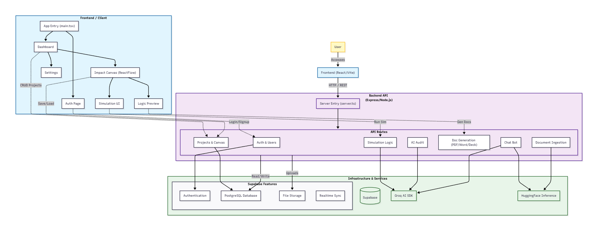

# NitiNirmaan

**NitiNirmaan** is a cutting-edge platform designed for advanced policy making, impact planning, and logical framework analysis. It empowers organizations to design, simulate, and audit their social impact projects with precision using AI-driven insights and visual modeling tools.



## 🚀 Features

### Core Functionality
- **Impact Canvas**: A powerful, infinite canvas built with ReactFlow for visual logic modeling, allowing users to map out project goals, inputs, outputs, and outcomes.
- **Logical Framework Analysis (LFA)**: Automatically generates structured LFA matrices and stakeholder shift maps from your visual canvas.
- **Monte Carlo Simulations**: Advanced simulation engine to forecast project outcomes and calculate success probabilities based on defined variables.
- **AI Audit**: Intelligent auditing system powered by **Groq** that analyzes your project logic for gaps, inconsistencies, and improvements.

### Productivity & Collaboration
- **Real-time Collaboration**: Seamless multi-user editing and synchronization powered by Supabase Realtime.
- **Document Generation**: One-click export of project reports to **PDF**, **Word**, and **PowerPoint** formats.
- **AI Companion (Bee Bot)**: Context-aware chat assistant to help guide you through the planning process.
- **Organization Management**: Manage teams, branding, and asset settings.

## 🛠️ Tech Stack

### Frontend
- **Framework**: [React](https://react.dev/) + [Vite](https://vitejs.dev/)
- **Language**: TypeScript
- **Styling**: [Tailwind CSS](https://tailwindcss.com/)
- **UI Components**: [Radix UI](https://www.radix-ui.com/), [Shadcn/UI](https://ui.shadcn.com/)
- **Animations**: [Framer Motion](https://www.framer.com/motion/), [GSAP](https://gsap.com/)
- **Visuals**: [ReactFlow](https://reactflow.dev/) (Canvas), [Three.js](https://threejs.org/) (Visualizations)

### Backend
- **Runtime**: [Node.js](https://nodejs.org/)
- **Framework**: [Express.js](https://expressjs.com/)
- **Language**: TypeScript
- **AI Integration**:
    - **Groq SDK** (LLM Inference)
    - **HuggingFace Inference** (Embeddings & Analysis)
- **Document Processing**: `docx`, `jspdf`, `pptxgenjs`

### Infrastructure
- **Database**: [Supabase](https://supabase.com/) (PostgreSQL)
- **Authentication**: Supabase Auth
- **Storage**: Supabase Storage
- **Realtime Services**: Supabase Realtime

## 📦 Installation

To get the project up and running smoothly, follow these inputs.

### Prerequisites
- Node.js (v18+)
- npm or pnpm

### 1. Clone the repository
```bash
git clone https://github.com/RJScripts-24/NitiNirmaan.git
cd NitiNirmaan
```

### 2. Setup Backend
```bash
cd backend
npm install
# Create a .env file based on .env.example
npm run dev
```

### 3. Setup Frontend
```bash
cd ../frontend
npm install
# Create a .env file based on .env.example
npm run dev
```

## 📜 License

This project is proprietary software.

**Copyright (c) 2026 Rishabh Kumar Jha. All Rights Reserved.**

See the [LICENSE](./License.md) file for details. You are **NOT** allowed to copy, distribute, or use this code without explicit permission.

## 👤 Author

**Rishabh Kumar Jha**
- GitHub: [@RJScripts-24](https://github.com/RJScripts-24)

---
*Built with ❤️ for impactful policy making.*
